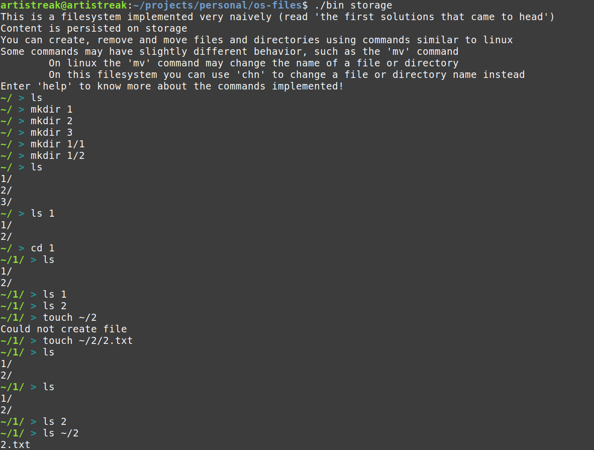
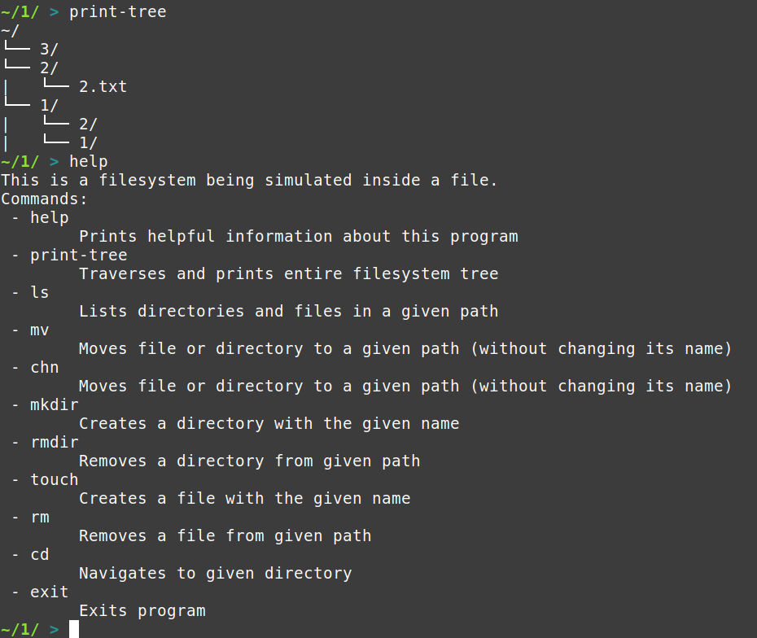

# My filesystem

This filesystem uses a file as storage. Some linux commands were implemented, and everything was implemented
naively.

Repository: https://github.com/artistrea/my-filesystem

## How to run

First build:
```bash
make
```

Then run passing any filename to use as storage:
```bash
./bin any-filename
```

Example usage:





